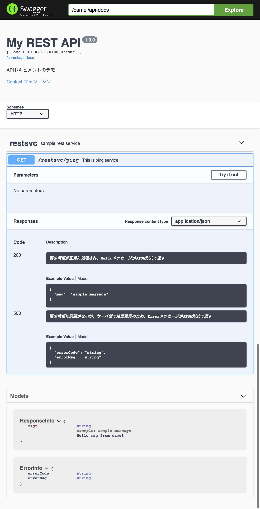

# Swagger UIとCamel REST DSL

このサンプルでは、**Swagger UI** を使用して、**RES DSL** で定義されたAPIのAPIドキュメント(WebAPI仕様書)を表示します。
[サンプルのソースコード][0]はGithubからダウンロードできます。

- [Swagger][1] とは、RESTful APIのドキュメントや、サーバ、クライアントコード、エディタ、またそれらを扱うための仕様などを提供するフレームワークであります。
- [Swagger UI][2] とは、[Swagger Specification][3]から動的にドキュメントを生成するツールです。
- [RES DSL][4] とは、CamelルートでREST APIを記述するDSLです。


このサンプルでは、以下の仕組みでSwagger UIとREST DSLを連携します。
- REST DSL + DataModel ==> Swagger API Route ==> Swagger Specification自動生成
- Swagger UI ==> Swagger Specification読み込み ==> APIドキュメント自動生成 ==> 簡単なAPIテスト

[0]: https://github.com/jian-feng/camel-restdsl-swagger-demo
[1]: https://swagger.io
[2]: https://swagger.io/tools/swagger-ui/
[3]: https://swagger.io/specification/
[4]: https://camel.apache.org/rest-dsl.html

## 実行方法

	mvn spring-boot:run

## Swagger UIの表示

	http://localhost:8080/webjars/swagger-ui/3.22.0/index.html?url=/camel/api-docs



## 設定方法

REST DSLでREST APIを開発する方法は、これらの記事をご参照ください。
1. [Creating a REST API in Apache Camel](https://cleverbuilder.com/articles/camel-rest/)
2. [Get started with REST services with Apache Camel](https://opensource.com/article/18/9/camel-rest-dsl)
3. [29行でメール送信サービスを作る - Apache Camel](https://qiita.com/daikuro/items/57b68d927ea81c81b3b3)


今回は、REST DSL開発ではなく、**主にSwagger UI連携するための設定** を説明させてください。


### Step 0. Swagger UIの組み込み

`pom.xml`にSwaggerライブラリを追加します。

```xml
<!-- Swagger support for restdsl -->
<dependency>
	<groupId>org.apache.camel</groupId>
	<artifactId>camel-swagger-java-starter</artifactId>
</dependency>
<dependency>
	<groupId>org.webjars</groupId>
	<artifactId>swagger-ui</artifactId>
	<version>${swagger.ui.version}</version>
</dependency>
```

### Step 1. REST Configuration

Camel提供のSwagger設定項目を使用して、API全体の概要情報をRest configuration(`camel-context.xml`の`<restConfiguration>`)に記述します。

例:

```xml
<restConfiguration apiComponent="swagger"
    apiContextPath="/api-docs" component="servlet"
    contextPath="/camel" enableCORS="true" host="0.0.0.0" port="8080">
    <dataFormatProperty key="prettyPrint" value="true"/>
    <!-- 設定可能なapiProperty一覧は、Swaggerドキュメントを参照 -->
    <!-- http://swagger.io/specification/#infoObject -->
    <apiProperty key="api.title" value="My REST API"/>
    <apiProperty key="api.version" value="1.0.0"/>
    <apiProperty key="api.description" value="APIドキュメントのデモ"/>
    <apiProperty key="api.contact.name" value="フェン　ジン"/>
    <apiProperty key="api.contact.email" value="jfeng@redhat.com"/>
</restConfiguration>
```

- `apiComponent` , `apiContextPath` `enableCORS`は、Swagger有効化ため最低限の設定。他に設定可能な内容は、[こちら][5]を参照してください。
- `<apiProperty>`は、API情報(infoObject)の設定。他に設定可能な内容は、[こちら][6]を参照してください。

[5]: https://camel.apache.org/rest-dsl.html
[6]: https://swagger.io/specification/#infoObject

### Step 2. REST Context

Camel提供のSwagger設定項目を使用して、個々のAPIの詳細(例、要求／応答のデータタイプなど)をRest context(`camel-context.xml`の`<rest>`)に記述します。

> Rest contextを別XMLで記述し、Camel-context.xmlにてincludeすることもできます。

例:

```xml
<rest bindingMode="off" id="rest-1" path="/restsvc">
    <description>sample rest service</description>
    <get id="get-1" uri="/ping">
        <description>This is ping service</description>
        <responseMessage code="200"
            message="要求情報が正常に処理され、HelloメッセージがJSON形式で返す" responseModel="org.mycompany.ResponseInfo"/>
        <responseMessage code="500"
            message="要求情報に問題がないが、サーバ側で処理異常のため、ErrorメッセージがJSON形式で返す" responseModel="org.mycompany.ErrorInfo"/>
        <route>
            <to uri="direct:hello"/>
        </route>
    </get>
</rest>
```

- `<description>` , `<responseMessage>` は、Swagger有効化ため最低限の設定。他に設定可能な内容は、[こちら][5]を参照してください。


### Step 3. DataModel

Swagger Coreのモデルプロパティ定義（@ApiModelProperty）アノテーションを使って、個々のDataModelに補足情報を追加します。

要求・応答情報のデータモデルやリソースモデル内で定義している各プロパティに `@ApiModelProperty` を用いて、プロパティの説明や入力例、プロパティの表示順序などを設定できます。以下は主要なメソッドを説明します。

	メソッド		説明  
	value		プロパティ名を指定します。  
	required		プロパティが必須かどうかを指定します。 (default: false)  
	example		プロパティの入力例を指定します。  
	position		プロパティの表示順序を指定します。 (default: 0)  

例: `src/main/java/org/mycompany/ResponseInfo.java`

```java
import io.swagger.annotations.ApiModelProperty;

public class ResponseInfo {
	@ApiModelProperty(value = "Hello msg from camel", required = true, example = "sample message")
	private String msg;

	public String getMsg() {
		return msg;
	}

	public void setMsg(String msg) {
		this.msg = msg;
	}
}
```
